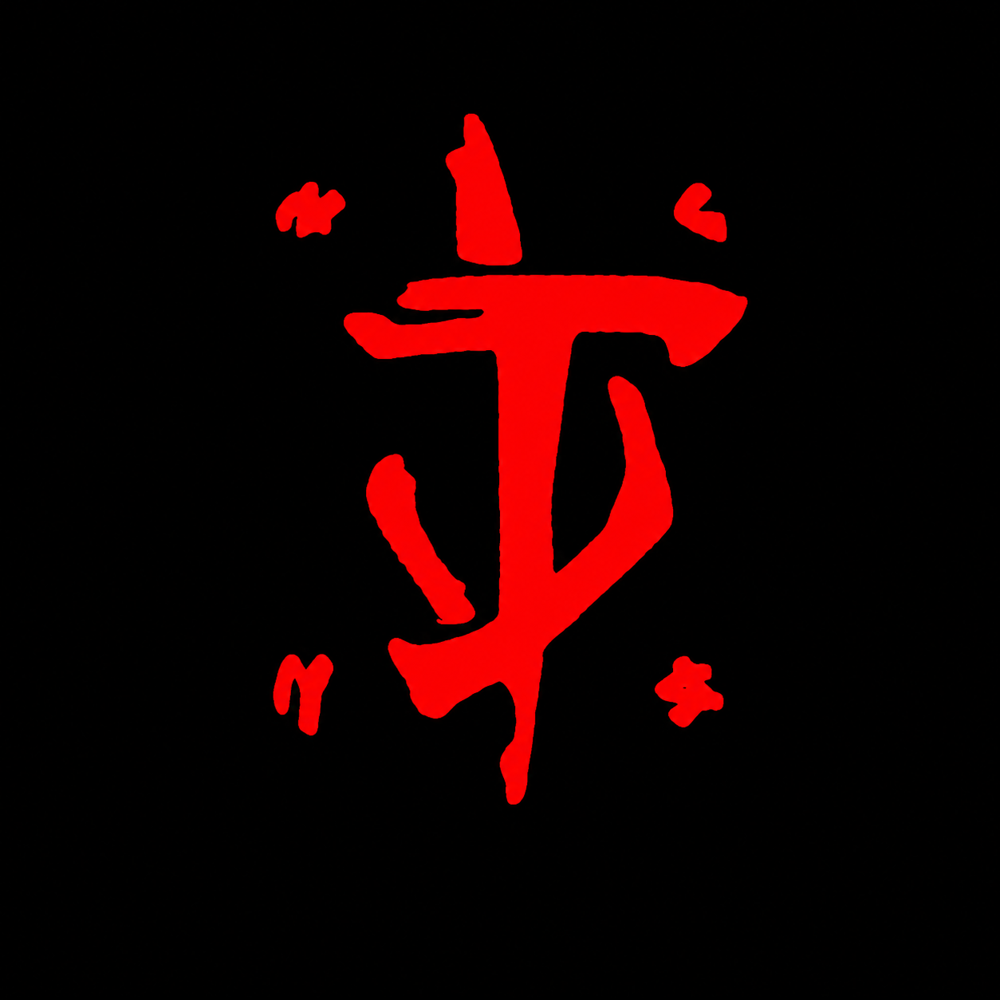

# 👋 Hi, I'm Sergio Izaque

### Computer Science Education Student • IT Technician • Developer 

  

I build **web, mobile and computer vision applications**, focusing on real-world projects involving **sports, education, management systems and automation**.

---

## 👨‍💻 About Me

I'm a **Computer Science Education student at Universidade Federal Fluminense (UFF)** and an **IT Technician**.

My main interest is building software that solves real problems. I enjoy working across different areas of development, from **full-stack web applications and mobile apps to computer vision and AI-assisted systems**.

Currently, I'm developing projects involving:

* 🏋️ Sports and fitness technology
* 🥗 Nutrition management systems
* 🧠 Computer vision and motion analysis
* 📱 Web and mobile applications
* 🤖 Artificial Intelligence integrations
* ☁️ Cloud-based applications
* 🎓 Educational technology

I'm particularly interested in improving my knowledge of **software architecture, testing, code quality, automation and scalable application development**.

---

## 🚀 What I'm Working On

### 🏋️ Gym Management Platform

A web and mobile ecosystem designed to connect **trainers and students**, helping manage workouts, exercises, training sessions and progress.

The platform includes features such as exercise load tracking, workout history, personal records and offline synchronization.

**Main technologies:**

`TypeScript` `React Native` `Expo` `Firebase` `Firestore` `Vercel`

> 🔒 Private repository — real-world project currently under development.

---

### 🏃 Sports Motion Analyzer

A computer vision project focused on **sports movement analysis**.

The goal is to analyze body movement through camera input and use pose tracking to evaluate sports techniques.

The project is initially focused on **Taekwondo movements**, with possibilities of expanding to other sports and multiple camera configurations.

**Main technologies:**

`Python` `Computer Vision` `MediaPipe` `OpenCV` `AI`

> 🎓 Academic / research project.

---

### 🥗 Nutrition Management Platform

A system designed for **nutritionists and patients**, providing tools for nutrition planning and patient management.

The platform is being designed around real professional workflows, including diet creation, diet versions, meal organization, food substitutions and patient monitoring.

The architecture also considers integrations with **AI models and external services**.

**Main technologies:**

`TypeScript` `React` `Firebase` `Vercel` `AI APIs`

> 🚧 Currently in development.

---

## 🛠️ Tech Stack

### 💻 Languages

### 🌐 Frontend

### 📱 Mobile

### ☁️ Backend & Cloud

### 👁️ Computer Vision & AI

### 🔧 Tools

---

## 🌱 Currently Learning

I'm continuously improving my knowledge in:

* Software architecture
* Automated testing
* Clean code
* Design patterns
* Full-stack development
* Computer vision
* Artificial Intelligence integration
* Cloud infrastructure
* CI/CD
* Application security
* Software scalability

---

## 🎯 Areas of Interest

* Full-Stack Development
* Mobile Development
* Computer Vision
* Artificial Intelligence
* Sports Technology
* Educational Technology
* Automation
* Cloud Applications

---

## 📊 GitHub Stats

---

## 🤝 Let's Connect

I'm always interested in learning, building new projects and collaborating with other developers.

You can find me here:

* 💼 [LinkedIn](https://linkedin.com/in/sergioizaque)
* 📸 [Instagram](https://www.instagram.com/sergio_izaque_tkd)
* 💻 [GitHub](https://github.com/krrozino)

---

### Building, learning and improving one project at a time.

